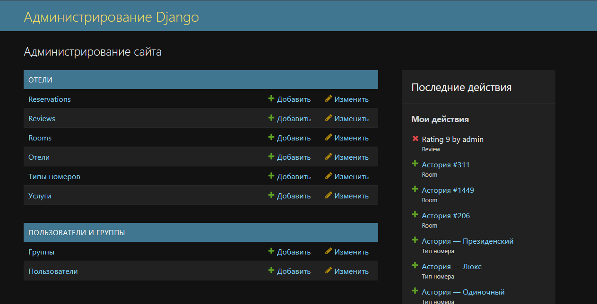

# Система бронирования отеля

## Задание:

Система должна предоставлять пользователям возможность просматривать список отелей, бронировать номера, оставлять отзывы о проживании и управлять своими бронями. Администратор должен иметь возможность управлять всеми сущностями через Django Admin, включая заселение и выселение клиентов.

Необходимо реализовать следующий функционал:

* Регистрация новых пользователей.
* Просмотр и резервирование номеров. Пользователь должен иметь возможность редактирования и удаления своих резервирований.
* Написание отзывов к номерам. При добавлении комментариев, должны сохраняться период проживания, текст комментария, рейтинг(1-10), информация о комментаторе.
* Администратор должен иметь возможность заселить пользователя в отель и выселить из отеля средствами Django-admin.
* В клиентской части должна формироваться таблица, отображающая постояльцев отеля за последний месяц.
## Ход выполнения

### Модели данных

Для начала была спроектирована основа приложения — модели данных, отражающие предметную область гостиничного бизнеса:

* Hotel — хранит информацию об отелях: название, адрес, описание.
* RoomType — содержит тип номера, его вместимость и стоимость.
* Room — конкретные номера, принадлежащие определённому отелю и типу номера.
* Reservation — информация о бронировании: пользователь, номер, даты заезда и выезда, статус.
* Review — отзывы пользователей, включающие рейтинг, текст комментария, даты проживания и автора.

Для связей использовались соответствующие поля:
- ForeignKey — для отношений “многие к одному” (например, номер → отель)
- ManyToManyField — для услуг, которые могут принадлежать нескольким отелям;
- OneToOneField — для профилей пользователей при необходимости расширения

```
class Reservation(models.Model):
    user = models.ForeignKey(User, on_delete=models.CASCADE)
    room = models.ForeignKey(Room, on_delete=models.CASCADE)
    check_in = models.DateField()
    check_out = models.DateField()
    status = models.CharField(max_length=20, choices=[
        ("reserved", "Забронировано"),
        ("checked_in", "Заселен"),
        ("checked_out", "Выселен"),
    ])
    created_at = models.DateTimeField(auto_now_add=True)

```
Для удобства отображения в админке реализованы методы __str__, возвращающие понятные строки (например, номер комнаты или название отеля).

### Формы

Были созданы кастомные формы на основе моделей для взаимодействия с пользователем:

* SignUpForm — регистрация нового пользователя.
* ReservationForm — форма для бронирования номера с проверкой корректности введённых дат.
* ReviewForm — форма для добавления отзыва с рейтингом и комментариями.

```
class ReviewForm(forms.ModelForm):
    class Meta:
        model = Review
        fields = ["period_from", "period_to", "rating", "text"]
```


### URL адреса и навигация

Для удобной навигации по сайту была реализована маршрутизация с помощью Django URL Dispatcher:

```
urlpatterns = [
    path('', views.hotels_list, name='hotels_list'),
    path('hotel/<int:pk>/', views.hotel_detail, name='hotel_detail'),
    path('room/<int:room_id>/reserve/', views.reserve_room, name='reserve_room'),
    path('my_reservations/', views.my_reservations, name='my_reservations'),
    path('reservation/<int:pk>/cancel/', views.cancel_reservation, name='cancel_reservation'),
    path('room/<int:room_id>/review/', views.write_review, name='write_review'),
    path('occupants/', views.occupants_last_month, name='occupants'),
    path('signup/', views.signup, name='signup'),
]
```
Была реализована логическая навигация между страницами с кнопками "Назад", "В профиль", "Все задания" для удобства пользователей.

* “Войти / Выйти”
* “Мои бронирования”
* “Регистрация”
* “Забронировать”
* “Оставить отзыв”

### Представления
Логика работы приложения реализована с помощью Function Based Views с использованием декораторов для контроля доступа:

* **@login_required** - ограничивает доступ неавторизованным пользователям
* @user_passes_test - для проверки прав администратора

Основные views включают:
- list — вывод списка всех отелей
- detail — детальная информация об отеле, доступные номера, отзывы гостей
- reserve_room — создание нового бронирования
- my_reservations — просмотр, редактирование и отмена собственных броней
- write_review — добавление отзывов о проживании
- occupants_last_month — генерация таблицы постояльцев за последний месяц

```
@login_required
def reserve_room(request, room_id):
    room = get_object_or_404(Room, id=room_id)
    if request.method == "POST":
        form = ReservationForm(request.POST)
        if form.is_valid():
            reservation = form.save(commit=False)
            reservation.user = request.user
            reservation.room = room
            reservation.save()
            return redirect('my_reservations')
    else:
        form = ReservationForm()
    return render(request, 'hotels/reserve.html', {'form': form, 'room': room})

```


### Панель администратора

Все модели зарегистрированы в Django Admin, что позволяет администраторам:

- добавлять и редактировать отели, номера и бронирования
- заселять и выселять клиентов
- управлять отзывами пользователей
- просматривать статистику по постояльцам



### Пользовательский интерфейс

Интерфейс выполнен с использованием Bootstrap 4 и кастомного CSS в тёмной цветовой палитре с красными акцентами.
Основные элементы интерфейса:

* Тёмная тема — основной фон и таблицы с мягким контрастом
* Красные заголовки и кнопки — визуальные акценты для ключевых действий
* Адаптивный дизайн — корректное отображение на любых устройствах
* Улучшенные таблицы — отображают брони, отзывы и постояльцев

### Ключевые функции

1. Регистрация и авторизация пользователей.
2. Просмотр отелей и доступных номеров.
3. Создание, редактирование и удаление бронирований.
4. Добавление отзывов с рейтингом и текстом.
5. Администрирование через Django Admin.
6. Автоматическая таблица постояльцев за последний месяц.


### Вывод

В ходе лабораторной работы была успешно разработана система бронирования отелей на Django.
Были реализованы все основные функции: регистрация пользователей, просмотр и бронирование номеров, редактирование и удаление броней, добавление отзывов и административное управление через Django Admin.

Проект продемонстрировал уверенное владение Django ORM, системой шаблонов, формами, маршрутизацией и Bootstrap-оформлением.
Система получилась удобной, логичной и визуально приятной, полностью соответствующей требованиям задания.
