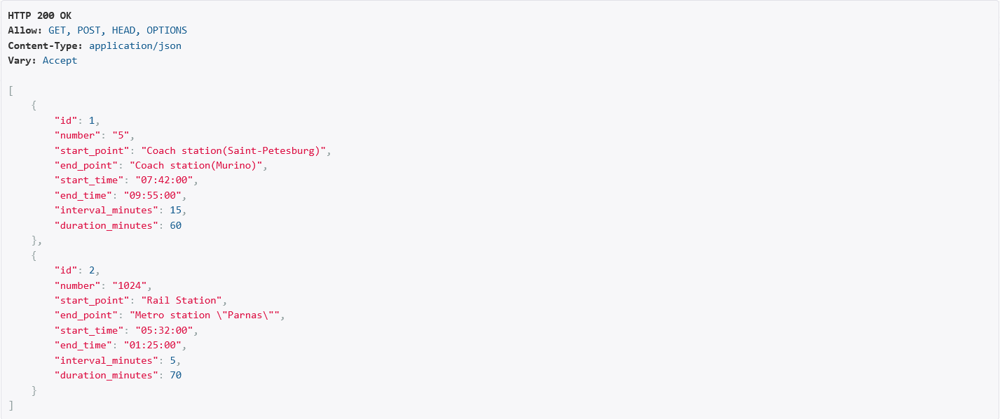

# РЕАЛИЗАЦИЯ СЕРВЕРНОЙ ЧАСТИ ПРИЛОЖЕНИЯ СРЕДСТВАМИ DJANGO И DJANGORESTFRAMEWORK

## Задание:

Реализовать сайт, используя фреймворк Django 3, Django REST Framework, Djoser и СУБД PostgreSQL *, в соответствии с вариантом задания лабораторной работы.

1. Реализовать модель базы данных средствами DjangoORM.
2. Реализовать логику работу API средствами Django REST Framework (используя
методы сериализации).
3. Подключить регистрацию / авторизацию по токенам / вывод информации о текущем
пользователе средствами Djoser.
## Ход выполнения

### Модели данных

Для выполнения данной лабораторной работы я использовал вариант 9(программная система, предназначенная для диспетчера автобусного парка)

* BusType — хранит информацию об название типа (городской, междугородний и т. п.), вместимость.
* Bus — содержит государственный регистрационный номер, принадлежность к типу __BusType__.
* Route — хранит номер маршрута, начальная и конечная точки, время начала/окончания движения, интервал движения, протяжённость (в минутах).
* Driver — информация о водителе: ФИО, паспортные данные, водительский класс, стаж и базовый оклад + надбавки.
* WorkShift — дату смены, водителя, автобус, маршрут, время начала/окончания работы, статус и причину (если не вышел).




### Реализация API через DRF

Для каждой модели создан ModelViewSet.

На примере класса водитель:

```
class DriverViewSet(ModelViewSet):
    queryset = Driver.objects.all()
    serializer_class = DriverSerializer
```

Сериализатор:

```
class DriverSerializer(serializers.ModelSerializer):
    class Meta:
        model = Driver
        fields = '__all__'
        read_only_fields = ['salary']
```

Маршрутизация через DefaultRouter:

```
router.register('drivers', DriverViewSet)
router.register('buses', BusViewSet)
router.register('bus-types', BusTypeViewSet)
router.register('routes', RouteViewSet)
router.register('shifts', WorkShiftViewSet)
```

API:
```
/api/drivers/
/api/buses/
/api/routes/
/api/shifts/
```

### Авторизация и регистрация (Djoser)

Авторизация реализована по токенам:

Регистрация:

```
POST /auth/users/
```
Получение токена:

```
POST /auth/token/login/
```


### Панель администратора

Django Admin позволяет:

- добавлять автобусы, водителей, маршруты
- редактировать смены
- смотреть данные в удобных таблицах


### Вывод

В ходе лабораторной работы была конструктивно разработана серверная часть системы для диспетчера автобусного парка на базе Django, DRF и Djoser. Реализованы все ключевые элементы: модели данных, REST API, сериализация, токенная авторизация и административное управление через Django Admin.

Проект продемонстрировал уверенное владение Django ORM, маршрутизацией, инструментами Django REST Framework, а также умение организовывать логику приложения и структурировать данные в соответствии с предметной областью.