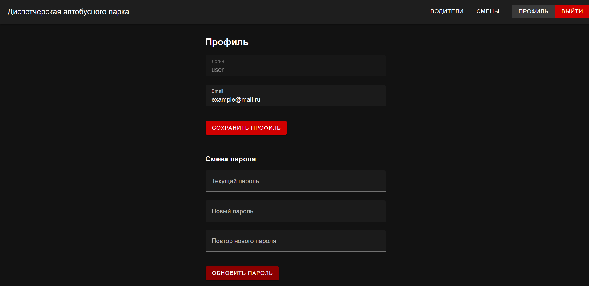
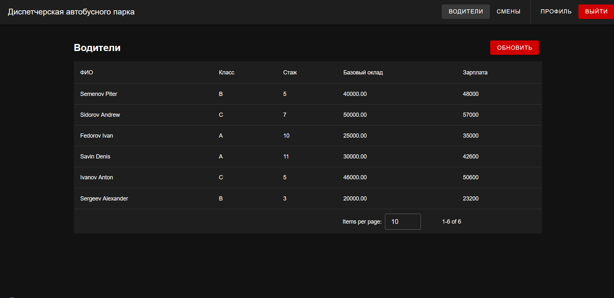
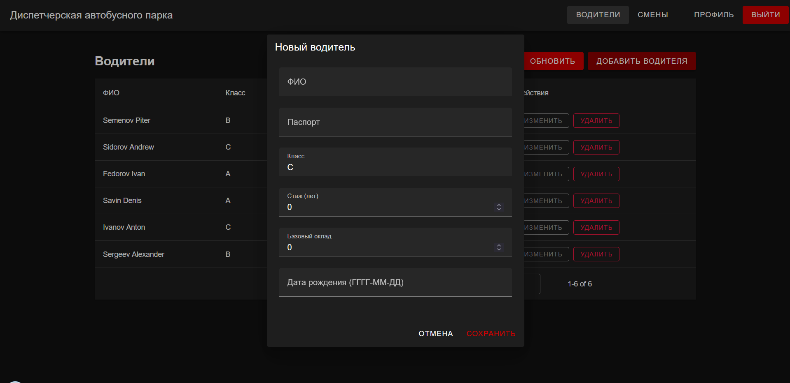

# Реализация клиентской части средствами Vue.js.

## Задание:

Разработать современное клиентское приложение для диспетчера автобусного парка на основе Vue.js, обеспечив:

* удобный интерфейс управления водителями и сменами;
* авторизацию и регистрацию пользователей;
* корректное взаимодействие с REST-API серверной части;

В качестве UI-фреймворка использован Vuetify 3, позволяющий построить адаптивный, современный и стильный интерфейс.

## Ход выполнения

### Создание проекта и структура frontend

Для разработки клиентской части был создан проект:

```
npm create vue@latest frontend
cd frontend
npm install
npm install vuetify axios vue-router
```


### Настройка взаимодействия с API

В проекте создан собственный HTTP-клиент:

```
const http = axios.create({
  baseURL: "http://localhost:8000",
})
```

При каждом запросе автоматически подставляется токен:

```
http.interceptors.request.use((config) => {
  const token = localStorage.getItem("auth_token")
  if (token) {
    config.headers.Authorization = `Token ${token}`
  }
  return config
})
```

### Реализация авторизации, регистрации и профиля

Пользователь вводит логин и пароль и фронт отправляет запрос:

```
POST /auth/token/login/
```
Полученный токен сохраняется в реактивном хранилище:

```
login(res.data.auth_token)
```
И записывается в localStorage, что позволяет хранить сессию между перезагрузками страницы.

Регистрация происхит через Djoser:

```
POST /auth/users/
```
Также пользователь ожет изменять свои учётные данные, а именно:

* email (PATCH /auth/users/me/)
* пароль (POST /auth/users/set_password/)

Интерфейс выполнен на Vuetify и представляет собой две формы:

* обновление профиля
* смена пароля



### Интерфейс "Водители"
Страница /drivers отображает таблицу водителей:

* ФИО
* Класс
* Стаж
* Оклад
* Рассчитанная зарплата



### Интерфейс "Смены"
Страница /shifts позволяет:

* просматривать все смены (водитель может встречаться много раз)
* видеть статус: "Вышел", "Поломка", "Нет водителя"
* выбирать автобус, маршрут и время


### Пользователи
Было произведено разделение на обычных пользователей и администраторов. Обычные пользователи могут только просматривать список водителей и смен. Администратор же может, помимо просмотра, редактировать эти страницы, а именно:

* добовлять новых водителей
* изменять данные уже существующих водителей
* добовлять новые смены
* изменять уже существующие смены

Все изменения происходят по средсву диалогого окна __v-dialog__.




### Вывод

В ходе разработки была создана современная, функциональная frontend-часть системы диспетчеризации автобусного парка. На основе Vue.js + Vuetify реализован удобный, адаптивный и визуально цельный интерфейс, полностью интегрированный с backend-частью на Django REST Framework.

Созданный клиент обладает:

* интуитивной навигацией
* поддержкой токенов авторизации
* гибкой ролевой системой
* удобными таблицами и формами
* мгновенным взаимодействием с API