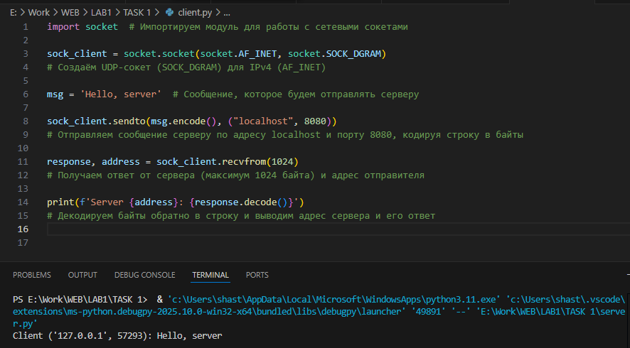
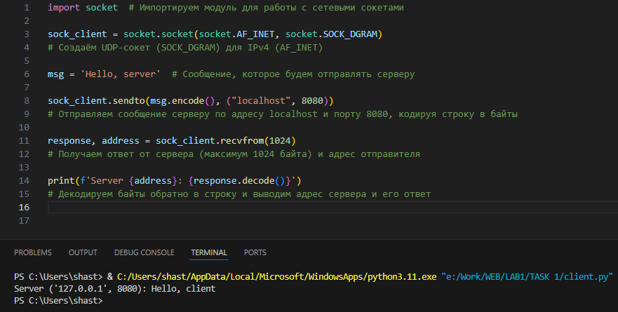

# [Лабораторная работа №1](lab1.md)

# **Задание 1**

## Цель

Реализовать клиентскую и серверную часть приложения. Клиент отправляет серверу сообщение «Hello, server», и оно должно отобразиться на стороне сервера. В ответ сервер отправляет клиенту сообщение «Hello, client», которое должно отобразиться у клиента.

**Требования**

- Обязательно использовать библиотеку socket.
- Реализовать с помощью протокола UDP.


## Выполнение
В ходе выполнения были реализованы клиент и сервер, где:

- **Клиент** отправляет строку "Hello, server" серверу по протоколу UDP.  
- **Сервер** принимает сообщение и выводит его в консоль.  
- В ответ сервер отправляет строку "Hello, client", которая отображается в консоли у клиента.  


### **Клиент**

```python
import socket  # Импортируем модуль для работы с сетевыми сокетами

sock_client = socket.socket(socket.AF_INET, socket.SOCK_DGRAM)  
# Создаём UDP-сокет (SOCK_DGRAM) для IPv4 (AF_INET)

msg = 'Hello, server'  # Сообщение, которое будем отправлять серверу

sock_client.sendto(msg.encode(), ("localhost", 8080))  
# Отправляем сообщение серверу по адресу localhost и порту 8080, кодируя строку в байты

response, address = sock_client.recvfrom(1024)  
# Получаем ответ от сервера (максимум 1024 байта) и адрес отправителя

print(f'Server {address}: {response.decode()}')  
# Декодируем байты обратно в строку и выводим адрес сервера и его ответ
```

### **Сервер**

```python
import socket  # Импортируем модуль socket для работы с сетевыми соединениями

sock_server = socket.socket(socket.AF_INET, socket.SOCK_DGRAM)  
# Создаём UDP-сокет (SOCK_DGRAM) для протокола IPv4 (AF_INET)

sock_server.bind(('localhost', 8080))  
# Привязываем сокет к адресу 'localhost' и порту 8080, чтобы сервер мог принимать данные

while True:  # Бесконечный цикл для постоянного прослушивания входящих сообщений
    request, address = sock_server.recvfrom(1024)  
    # Получаем сообщение от клиента и его адрес; буфер ограничен 1024 байтами
    print(f'Client {address}: {request.decode()}')  
    # Декодируем байты в строку и выводим сообщение клиента в консоль

    msg = 'Hello, client'  # Создаём ответное сообщение
    sock_server.sendto(msg.encode(), address)  
    # Кодируем строку в байты и отправляем обратно клиенту по его адресу
```

## Результат

При запуске сервер ожидает сообщения.
На стороне клиента:

```
Hello, client
```

На стороне сервера:

```
Hello, server
```
Результаты работы после запуска обоих файлов:





## Вывод

Реализовал простую клиент-серверную архитектуру с использованием UDP-сокетов. Клиент отправляет сообщение серверу, сервер его принимает и отвечает клиенту.