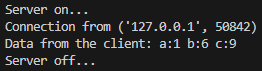

# [Лабораторная работа №1](lab1.md)

# **Задание 2**

## Цель

Реализовать клиентскую и серверную часть приложения. Клиент запрашивает выполнение математической операции, параметры которой вводятся с клавиатуры. Сервер обрабатывает данные и возвращает результат клиенту.

**Требования**

- Решение квадратного уравнения.


## Выполнение
В ходе выполнения были реализованы клиент и сервер, где:

- **Клиент** подключается к серверу, вводит 3 числа и отправляет их.  
- **Сервер** принимает числа, вычисляет решение квадратного уравнения вида ax^2 + bx + c = 0 через формулу дискриминанта и возвращает результат клиенту.  
- На сервере обработан случай, если уравнение имеет 1 корень или же не имеет действительных корней. 


### **Клиент**

```python
import socket  # Импортируем модуль для работы с сетевыми сокетами

sock_client = socket.socket(socket.AF_INET, socket.SOCK_STREAM)  
# Создаём TCP-сокет (SOCK_STREAM) для IPv4 (AF_INET)

sock_client.connect(('localhost', 8080))  
# Подключаемся к серверу на localhost и порту 8080

msg = input("Enter 3 numbers (abc) separated by a space to solve the quadratic equation ax^2 + bx + c = 0\n")  
# Просим пользователя ввести 3 числа a, b и c для решения квадратного уравнения

sock_client.sendall(msg.encode())  
# Отправляем сообщение серверу, кодируя строку в байты

response = sock_client.recv(1024)  
# Получаем ответ от сервера (максимум 1024 байта)

print(f'Server: {response.decode()}')  
# Декодируем байты обратно в строку и выводим ответ сервера

sock_client.close()  
# Закрываем соединение с сервером
```

### **Сервер**

```python
import socket  # Импортируем модуль для работы с сетевыми сокетами

def solve_sqr(a, b, c):  
    # Функция для решения квадратного уравнения ax^2 + bx + c = 0
    discr = b**2 - 4*a*c  
    # Вычисляем дискриминант
    if discr > 0:  
        # Если дискриминант положительный — два различных корня
        return f"Answer: x1 = {(-b + discr**0.5)/(2*a)}, x2 = {(-b - discr**0.5)/(2*a)}" 
    elif discr == 0:  
        # Если дискриминант равен нулю — один корень
        return f"Answer: x = {-b / (2 * a)}"
    else:  
        # Если дискриминант отрицательный — вещественных корней нет
        return "Discriminant < 0"
    
sock_server = socket.socket(socket.AF_INET, socket.SOCK_STREAM)  
# Создаём TCP-сокет для IPv4

sock_server.bind(('localhost', 8080))  
# Привязываем сокет к localhost и порту 8080

sock_server.listen(1)  
# Начинаем слушать входящие соединения, максимум 1 в очереди
print("Server on...")  

while True:  
    # Бесконечный цикл для приёма клиентов
    client_connect, client_address = sock_server.accept()  
    # Принимаем соединение от клиента, получаем объект сокета и адрес клиента
    print(f'Connection from {client_address}')  

    request = list(map(int, client_connect.recv(1024).decode().split()))  
    # Получаем данные от клиента (максимум 1024 байта), декодируем и превращаем в список чисел

    print(f'Data from the client: a:{request[0]} b:{request[1]} c:{request[2]}')  
    # Выводим полученные числа

    response = solve_sqr(request[0], request[1], request[2])  
    # Решаем квадратное уравнение

    client_connect.sendall(response.encode())  
    # Отправляем ответ клиенту

    client_connect.close()  
    # Закрываем соединение с клиентом
    print("Server off...")  
    # Сообщение о завершении работы с текущим клиентом
```

## Результат

Результат работы со стороны сервера:




Результаты работы после запуска 3-ех различных ситуаций со стороны клиента:


## Вывод

Реализовал клиент-серверную архитектуру с использованием TCP-сокетов для решения квадратного уравнения.