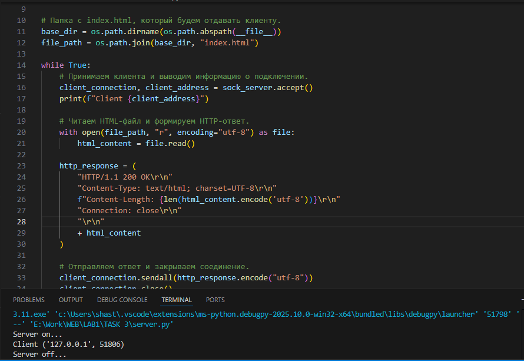
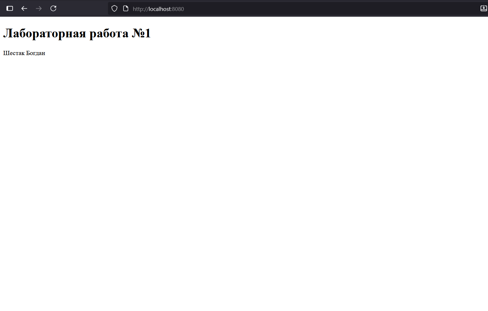

# [Лабораторная работа №1](lab1.md)

# **Задание 3**

## Цель

Реализовать серверную часть приложения. Клиент подключается к серверу, и в ответ получает HTTP-сообщение, содержащее HTML-страницу, которая сервер подгружает из файла index.html.

**Требования**

- Обязательно использовать библиотеку socket.


## Выполнение
В этой задаче нужно было создать простой веб-сервер с использованием сокетов.
Я выбрал протокол TCP, так как он используется в HTTP. На сервере сначала создаётся сокет через socket(), затем привязывается к адресу и порту (bind()) и переводится в режим ожидания подключений (listen()).

При подключении клиента (accept()) сервер получает HTTP-запрос, открывает файл index.html из той же папки, где находится скрипт, читает его содержимое и формирует ответ: заголовки HTTP/1.1 200 OK, Content-Type, Content-Length, после чего отправляется сам HTML-код через sendall().

Так как задача касалась только серверной части, в качестве клиента использовался браузер. При вводе localhost:8080 браузер отправляет GET-запрос и отображает HTML-страницу.

В итоге реализован минимальный веб-сервер, способный отдавать HTML-страницу.


### **Сервер**


```python
import socket  # Импортируем модуль для работы с сетевыми сокетами
import os      # Импортируем модуль для работы с файловой системой

# Создаем TCP-сокет (SOCK_STREAM) и привязываем его к адресу, чтобы слушать подключения
sock_server = socket.socket(socket.AF_INET, socket.SOCK_STREAM)
sock_server.bind(('localhost', 8080))  # Привязываем сокет к localhost:8080
sock_server.listen(1)  # Переводим сокет в режим прослушивания, с очередью 1 подключение
print("Server on...")  # Выводим сообщение, что сервер запущен

# Определяем путь к файлу index.html, который будем отдавать клиенту
base_dir = os.path.dirname(os.path.abspath(__file__))  # Директория текущего скрипта
file_path = os.path.join(base_dir, "index.html")       # Полный путь к index.html

while True:  # Бесконечный цикл для обработки подключений
    # Принимаем подключение от клиента
    client_connection, client_address = sock_server.accept()
    print(f"Client {client_address}")  # Выводим адрес подключившегося клиента

    # Открываем HTML-файл и читаем его содержимое
    with open(file_path, "r", encoding="utf-8") as file:
        html_content = file.read()  # Читаем весь файл в строку

    # Формируем HTTP-ответ
    http_response = (
        "HTTP/1.1 200 OK\r\n"  # Статус ответа 200 OK
        "Content-Type: text/html; charset=UTF-8\r\n"  # Тип содержимого: HTML с UTF-8
        f"Content-Length: {len(html_content.encode('utf-8'))}\r\n"  # Длина содержимого в байтах
        "Connection: close\r\n"  # Закрываем соединение после ответа
        "\r\n"  # Пустая строка, разделяющая заголовки и тело
        + html_content  # Тело ответа: HTML-код
    )

    # Отправляем клиенту HTTP-ответ полностью и закрываем соединение
    client_connection.sendall(http_response.encode("utf-8"))
    client_connection.close()
    print("Server off...")  # Сообщение о закрытии соединения
```

## Результат

Результат работы со стороны сервера:




Результаты работы со стороны браузера:



## Вывод

Создан минимальный HTTP-сервер на TCP сокетах, который корректно отдаёт HTML-страницу по запросу клиента. Это демонстрирует базовые принципы работы веб-серверов и взаимодействия по протоколу HTTP.