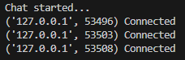
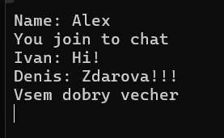
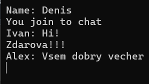
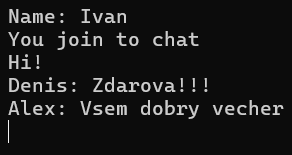

# [Лабораторная работа №1](lab1.md)

# **Задание 4**

## Цель

Реализовать двухпользовательский или многопользовательский чат. Для максимального количества баллов реализуйте многопользовательский чат.

**Требования**

- Обязательно использовать библиотеку socket.
- Для многопользовательского чата необходимо использовать библиотеку threading.

**Реализация**

- Протокол TCP: 100% баллов.
- Протокол UDP: 80% баллов.
- Для UDP используйте threading для получения сообщений на клиенте.
- Для TCP запустите клиентские подключения и обработку сообщений от всех пользователей в потоках. Не  забудьте сохранять пользователей, чтобы отправлять им сообщения.


## Выполнение
Был реализован полноценный многопользовательский чат: сервер принимает подключения нескольких клиентов и пересылает сообщения всем участникам.

На сервере для каждого подключения было выделено отдельная функция, запуск которой происходит в отдельном потоке. Список подключённых пользователей хранится в простом List, а для безопасной работы с ним при параллельной обработке сообщений использована блокировка threading.Lock(). Основной цикл сервера занимается приёмом новых подключений и добавлением их в чат, а функция в потоках отвечает за рассылку сообщений всем участникам.

На клиентской стороне тоже используется threading, чтобы одновременно принимать сообщения от сервера. В основном цикле клиент может вводить текст и отправлять его нажатием Enter.


### **Клиент**

```python
import socket      # Модуль для работы с сетевыми сокетами
import threading   # Модуль для работы с потоками

def process_recieve(sock_client):  
    # Функция для постоянного получения сообщений от сервера
    while True:  
        response = sock_client.recv(1024).decode()  
        # Получаем до 1024 байт и декодируем в строку
        print(response)  
        # Выводим сообщение на экран

sock_client = socket.socket(socket.AF_INET, socket.SOCK_STREAM)  
# Создаем TCP-сокет для клиента

sock_client.connect(('localhost', 8080))  
# Подключаемся к серверу по адресу localhost:8080

name = input("Name: ")  
# Просим пользователя ввести своё имя

thr = threading.Thread(target=process_recieve, args=(sock_client,))  
# Создаем поток для функции получения сообщений (чтобы принимать и печатать одновременно)
thr.start()  
# Запускаем поток

print("You join to chat")  
# Сообщение о подключении к чату

while True:  
    text = input()  
    # Ждем ввод текста от пользователя
    sock_client.sendall((name + ": " + text).encode())  
    # Отправляем введённое сообщение на сервер в виде "имя: сообщение"
```

### **Сервер**

```python
import socket      # Модуль для работы с сетевыми сокетами
import threading   # Модуль для работы с потоками (чтобы обрабатывать клиентов параллельно)

users = []          # Список подключенных клиентов
lock = threading.Lock()  
# Блокировка для безопасного доступа к общему списку users из разных потоков

def process_user(client_connection):  
    # Функция для обработки сообщений одного клиента
    global users  
    while True:  
        msg = client_connection.recv(1024)  
        # Получаем сообщение от клиента (до 1024 байт)
        with lock:  
            # Закрываем доступ к списку users на время отправки сообщений
            for user in users:  
                if user != client_connection:  
                    user.sendall(msg)  
                    # Отправляем сообщение всем клиентам, кроме отправителя

# Создаем TCP-сокет для сервера
sock_server = socket.socket(socket.AF_INET, socket.SOCK_STREAM)

sock_server.bind(('localhost', 8080))  
# Привязываем сокет к адресу localhost и порту 8080

sock_server.listen(5)  
# Начинаем слушать соединения, с очередью до 5 подключений
print("Chat started...")  

while True:  # Основной цикл для принятия новых клиентов
    client_connection, client_address = sock_server.accept()  
    # Принимаем подключение клиента
    print(f'{client_address} Connected')  

    with lock:  
        users.append(client_connection)  
        # Добавляем нового клиента в список пользователей безопасно

    thr = threading.Thread(target=process_user, args=(client_connection,))  
    thr.start()  
    # Создаем новый поток для обработки сообщений этого клиента
```

## Результат

Результат работы со стороны сервера:




Результаты работы от 3-ех различных клиентов:





## Вывод

Реализован многопользовательский TCP‑чат с потоковой обработкой и безопасной рассылкой сообщений:

- Сервер поддерживает любое количество подключений, каждое обрабатывается в отдельном потоке.
- Клиенты могут одновременно отправлять и получать сообщения через отдельный поток‑приёмник.
- Список подключений защищён Lock, при этом рассылка сообщений выполняется без блокировок.
