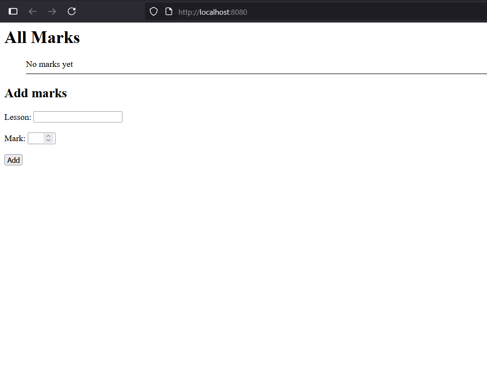
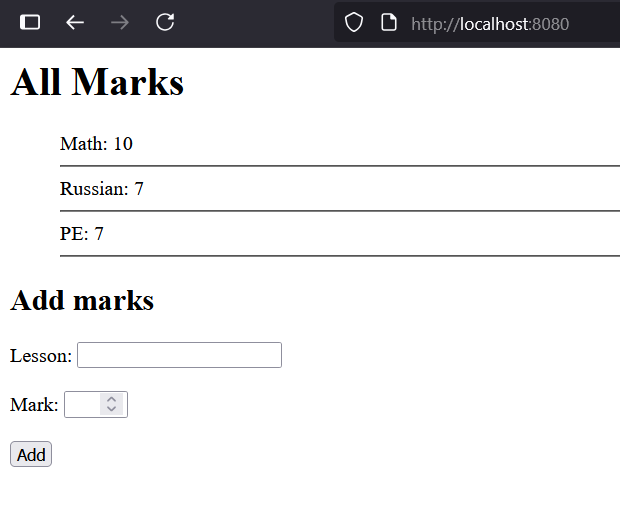

# [Лабораторная работа №1](lab1.md)

# **Задание 5**

## Цель

Написать простой веб-сервер для обработки GET и POST HTTP-запросов с помощью библиотеки socket в Python.

**Требования**

- Сервер должен:
    1. Принять и записать информацию о дисциплине и оценке по дисциплине.
    2. Отдать информацию обо всех оценках по дисциплинам в виде HTML-страницы.


## Выполнение
Cоздан минимальный веб‑сервер на Python, который обрабатывает HTTP‑запросы.
Сервер слушает указанный порт и при подключении клиента определяет метод запроса:

 - Для GET формируется HTML‑страница с текущими оценками из словаря journal и отправляется клиенту с кодом 200 OK.

 - Для POST сервер разбирает параметры формы, добавляет новую оценку в словарь и возвращает обновлённую HTML‑страницу.

 - Для всех остальных методов сервер возвращает код 405 Method Not Allowed.

HTML-страница создаётся функцией build_html(), которая включает список оценок и форму для добавления новых. Для разбора POST‑данных написана функция parse_post_data().


### **Сервер**

```python
import socket  # импортируем модуль для работы с сетевыми соединениями

HOST = "localhost"  # адрес сервера
PORT = 8080         # порт сервера

# создаём TCP-сокет
sock_server = socket.socket(socket.AF_INET, socket.SOCK_STREAM)

# словарь для хранения оценок: ключ - предмет, значение - строка оценок
journal = {}

# функция для генерации HTML-страницы со списком оценок и формой
def build_html():
    html = "<html><head><title>Marks</title></head><body>"  # начало HTML
    html += "<h1>All Marks</h1><ul>"  # заголовок и начало списка
    if journal:  # если есть записи в журнале
        for subj, mark in journal.items():  # перебираем все предметы и оценки
            html += f"{subj}: {mark}<hr>"  # добавляем предмет и его оценки в список
    else:
        html += "No marks yet<hr>"  # если оценок ещё нет
    html += "</ul>"  # конец списка
    # форма для добавления новой оценки
    html += """
    <h2>Add marks</h2>
    <form method="POST">
      Lesson: <input type="text" name="subject" required><br>
      <br>
      Mark: <input type="number" name="grade" min="1" max="10" required><br>
      <br>
      <input type="submit" value="Add">
    </form>
    """
    html += "</body></html>"  # конец HTML
    return html  # возвращаем готовую страницу

# функция для разбора параметров POST-запроса
def parse_post_data(data: str):
    # разделяем заголовки и тело запроса по двойному \r\n
    body = data.split("\r\n\r\n", 1)[1]
    params = {}  # словарь для параметров
    for pair in body.split("&"):  # тело приходит в формате key=value&key=value
        if "=" in pair:
            k, v = pair.split("=", 1)  # разделяем ключ и значение
            params[k] = v.replace("+", " ")  # заменяем + на пробел
    return params  # возвращаем словарь параметров

# запускаем сервер
with sock_server as s:
    s.bind((HOST, PORT))  # привязываем сокет к адресу и порту
    s.listen(5)           # начинаем слушать соединения (до 5 в очереди)
    print(f"Server started http://{HOST}:{PORT}")  # выводим сообщение о старте

    while True:  # бесконечный цикл для обработки подключений
        conn, addr = s.accept()  # принимаем подключение от клиента
        with conn:  # открываем контекст для соединения
            request = conn.recv(1024).decode("utf-8")  # читаем запрос (макс 1024 байта) и декодируем
            if not request:  # если запрос пустой, пропускаем
                continue

            first_line = request.split("\n")[0]  # первая строка запроса, например "GET / HTTP/1.1"
            method = first_line.split(" ")[0]    # извлекаем метод запроса (GET, POST и т.д.)

            # ---------------------- GET ----------------------
            if method == "GET":
                response_body = build_html()  # формируем HTML-страницу
                response = "HTTP/1.1 200 OK\r\n"  # статус ответа
                response += "Content-Type: text/html; charset=utf-8\r\n"  # заголовок типа контента
                response += f"Content-Length: {len(response_body.encode('utf-8'))}\r\n"  # длина тела ответа
                response += "Connection: close\r\n\r\n"  # закрытие соединения
                response += response_body  # добавляем HTML в тело ответа
                conn.sendall(response.encode("utf-8"))  # отправляем ответ клиенту

            # ---------------------- POST ----------------------
            elif method == "POST":
                params = parse_post_data(request)  # разбираем тело POST-запроса
                subj = params.get("subject", "None")  # извлекаем предмет
                grade = params.get("grade", "?")      # извлекаем оценку

                # проверяем, что оценка состоит из цифр
                if grade.isdigit():
                    if subj in journal:  # если предмет уже есть в журнале
                        journal[subj] += f" {grade}"  # добавляем новую оценку через пробел
                    else:
                        journal[subj] = grade  # если предмет новый, создаём запись

                response_body = build_html()  # формируем HTML-страницу с обновлёнными данными
                response = "HTTP/1.1 200 OK\r\n"  # статус ответа
                response += "Content-Type: text/html; charset=utf-8\r\n"  # заголовок типа контента
                response += f"Content-Length: {len(response_body.encode('utf-8'))}\r\n"  # длина тела
                response += "Connection: close\r\n\r\n"  # закрытие соединения
                response += response_body  # тело ответа
                conn.sendall(response.encode("utf-8"))  # отправляем клиенту

            # ---------------------- Остальные методы ----------------------
            else:
                response = "HTTP/1.1 405 Method Not Allowed\r\n\r\nMethod not supported"  # метод не поддерживается
                conn.sendall(response.encode("utf-8"))  # отправляем ошибку клиенту
```

## Результат

Результат работы:




## Вывод

Был реализован простой веб‑сервер на Python с поддержкой методов GET и POST, который позволяет отображать HTML‑страницу с оценками и добавлять новые записи через форму. Сервер корректно обрабатывает запросы, возвращает соответствующие коды состояния и защищён от неподдерживаемых методов. С помощью тестового скрипта можно проверять работу POST‑запросов и убедиться, что данные в журнале обновляются правильно.